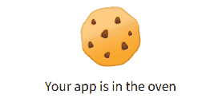
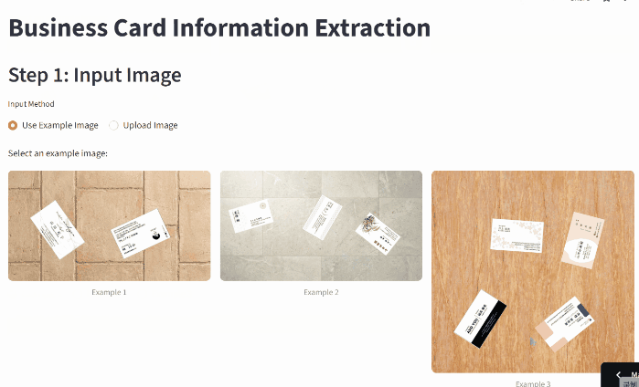

# 🪪 Business Card Information Extraction

[](https://projectbusiness-card-information-extraction.streamlit.app/)

🚀 **ライブデモ**: [https://projectbusiness-card-information-extraction.streamlit.app/](https://projectbusiness-card-information-extraction.streamlit.app/)
> [!NOTE]
> Streamlitの初回起動時には初期化が必要なため、しばらくお待ちください。
> <p align="left">
>  
> </p>

<p align="center">
  
</p>

## 📋 プロジェクト概要

本プロジェクトは、**背景画像から複数の名刺を自動検出し、各名刺から会社名・氏名・電話番号・メールアドレス・住所などの情報を抽出する**エンドツーエンドのシステムです。

### 🎯 解決する課題

- 複雑な背景から名刺領域を正確に検出
- 回転・傾きのある名刺を正立状態に補正
- 名刺上のテキスト情報を構造化されたデータとして抽出

### ✨ 主な機能

1. **名刺検出**: 背景画像から複数枚の名刺を同時検出
2. **名刺回正**: セグメンテーション + 分類モデルによる自動回転補正
3. **コンテンツ認識**: YOLO11による情報領域検出 + EasyOCRによるテキスト抽出
4. **JSON出力**: 抽出結果を構造化データとして出力

### 📸 結果プレビュー

<!-- 結果画像のプレースホルダー -->
| 入力画像 | 検出結果 | 抽出情報 |
|:--------:|:--------:|:--------:|
|  |  |  |

---

## 🛠️ 技術スタック

| カテゴリ | 技術・ライブラリ |
|:-------:|:-----------------|
| **深層学習フレームワーク** | PyTorch, Ultralytics (YOLO11) |
| **OCRエンジン** | EasyOCR |
| **画像処理** | OpenCV, NumPy, Pillow |
| **GUI** | Streamlit |
| **開発環境** | Google Colab (GPU A100対応) |

---

## 📁 プロジェクト構成

```
Business-card-information-extraction/
│
├── 📂 content_recognition/     # 名刺コンテンツ認識モデル & OCR
│   └── src/                    # train.py, predict.py, predict_ocr.py など
│
├── 📂 data/                    # データセット
│   ├── background/             # 背景画像
│   ├── business_card_raw/      # 元の名刺画像
│   ├── business_card_v1/       # 名刺データセット v1
│   └── business_card_v2/       # 名刺データセット v2 (コンテンツ認識用)
│
├── 📂 four_angles/             # 四角検出方式 (Strategy 1)
│   └── src/                    # 合成・学習コード
│
├── 📂 pose_four_points/        # YOLO11-Pose方式 (Strategy 2)
│   ├── step1_gen_kpt_synth.py     # データセット合成
│   ├── step2_split_kpt_dataset.py # Train/Val分割
│   ├── step3_train_kpt_hybrid.py  # モデル学習
│   └── step4_predict_and_warp_kpt.py  # 推論・回正
│
├── 📂 segmentation_classification/  # Seg+Cls方式 (Strategy 3) ⭐ 採用
│   └── tools/
│       ├── step1_generate_seg_dataset.py    # セグメンテーションデータ合成
│       ├── step2_split_seg_dataset.py       # Train/Val分割
│       ├── step3_train_seg_yolo11_dynamic_mix.py  # 動的ミックス学習
│       ├── step4_generate_upright_cls_dataset.py  # 分類データセット生成
│       ├── step4_train_upright_cls_yolo11.py      # 分類モデル学習
│       └── step5_predict_warp_upright_v5.py       # 推論・回正
│
├── 📂 streamlit/               # Streamlit GUIアプリ
│   └── app.py                  # 🚀 エントリーポイント
│
├── 📓 run-on-colab.ipynb       # Google Colab実行ノートブック
└── 📄 requirements.txt         # 依存パッケージ
```

> 💡 **ヒント**: 各ディレクトリ内のファイル名には実行順序が明記されています（step1, step2, ...）。順番に実行してください。

---

## 🚀 クイックスタート

### 🤖 YOLO11について

本プロジェクトでは **[YOLO11](https://docs.ultralytics.com/)** を採用しています。

**選定理由:**
- 🎯 リアルタイム推論性能（高速かつ高精度）
- 🔧 Segmentation / Pose / Classification など多様なタスクに対応
- 📦 Ultralyticsによる統一的なAPI・学習パイプライン
- 🌐 豊富なコミュニティサポート

---

### ⚙️ 環境準備

#### Option A: ローカルGPU環境

```bash
# リポジトリのクローン
git clone https://github.com/miracle-huang/Business-card-information-extraction.git
cd Business-card-information-extraction

# 仮想環境の作成 (推奨)
python -m venv .venv
.venv\Scripts\activate  # Windows
# source .venv/bin/activate  # Linux/Mac

# 依存パッケージのインストール
pip install -r requirements.txt
```

#### Option B: Google Colab (推奨・GPU無料)

📓 [run-on-colab.ipynb](run-on-colab.ipynb) を使用してください。

Colab環境では以下の手順で実行できます:
1. Google Driveにプロジェクトをクローン
2. 必要なパッケージを自動インストール
3. 各ステップのコードセルを順次実行

---

### 📊 データ準備

#### 名刺データの収集

- **素材**: インターネットから収集した公開名刺画像
- **前処理**: [Nano Banana](https://github.com/...)（超解像技術）による画像鮮明化処理

#### Roboflowによるデータ整理

アノテーション済みデータセットは以下で公開しています:

🔗 **[Roboflow Dataset](https://app.roboflow.com/learn-yolov11/jp-business-card-detection2/2)**

---

### 🔄 動的データ合成戦略

本プロジェクトの特徴的な学習戦略として、**動的データ合成**を採用しています。

**過学習防止のための工夫:**

```
各エポックのバッチ構成:
├── 50% 固定データセット（Roboflowから）
└── 50% 動的合成データ（毎エポック新規生成）
```

**合成プロセス:**
1. 背景画像をランダムに選択
2. 名刺画像を2～4枚ランダム配置
3. 回転角度をランダム適用 (0°〜360°)
4. YOLO形式のラベルを自動生成

この戦略により、モデルは多様なシナリオに対応できる汎化性能を獲得します。

---

## 🎴 背景からの名刺検出

本プロジェクトでは、背景画像から名刺を検出するために**3つのアプローチ**を検証しました。

### Strategy 1: 四角検出方式 (Four Angles)

📂 `four_angles/`

**手法**: 名刺の4つの角を検出し、透視変換で四角形を抽出

**実行手順:**
```bash
python four_angles/train_step3.py
```

**課題**: 
- ⚠️ 角の検出精度が低い場合、全体の抽出精度に大きく影響
- ⚠️ 複数名刺の重なりに弱い

---

### Strategy 2: YOLO11-Pose方式 (Pose Four Points)

📂 `pose_four_points/`

**手法**: YOLO11-Poseモデルで名刺の4隅をキーポイントとして検出

**実行手順:**
```bash
# Step 1: データセット合成
python pose_four_points/step1_gen_kpt_synth.py

# Step 2: Train/Val分割
python pose_four_points/step2_split_kpt_dataset.py

# Step 3: モデル学習
python pose_four_points/step3_train_kpt_hybrid.py

# Step 4: 推論・回正
python pose_four_points/step4_predict_and_warp_kpt.py
```

**課題**:
- ⚠️ キーポイントの順序が不安定になる場合がある
- ⚠️ 回転角度によっては正しい向きに補正できない

---

### Strategy 3: Segmentation + Classification ⭐ 採用

📂 `segmentation_classification/`

**手法**: 
1. YOLO11-Segで名刺領域をセグメンテーション
2. マスクから最小外接矩形を計算してクロップ
3. YOLO11-Clsで回転角度（0°/90°/180°/270°）を分類・補正

**実行手順:**
```bash
# Step 1: セグメンテーションデータ合成
python segmentation_classification/tools/step1_generate_seg_dataset.py

# Step 2: Train/Val分割
python segmentation_classification/tools/step2_split_seg_dataset.py

# Step 3: セグメンテーションモデル学習（動的ミックス）
python segmentation_classification/tools/step3_train_seg_yolo11_dynamic_mix.py

# Step 4.1: 分類データセット生成
python segmentation_classification/tools/step4_generate_upright_cls_dataset.py

# Step 4.2: 分類モデル学習
python segmentation_classification/tools/step4_train_upright_cls_yolo11.py

# Step 5: 推論・回正
python segmentation_classification/tools/step5_predict_warp_upright_v5.py
```

**✅ 採用理由**:
- セグメンテーションにより任意形状の名刺領域を正確に抽出
- 分類モデルで回転方向を確実に判定
- 2段階パイプラインで各タスクに最適化したモデルを使用可能
- 最も安定した結果を達成

### 📊 結果比較

| 方式 | 検出精度 | 回正精度 | 安定性 | 採用 |
|:----:|:-------:|:-------:|:------:|:----:|
| Four Angles | △ | △ | ✗ | - |
| Pose Four Points | ○ | △ | ✗ | - |
| **Seg + Cls** | **◎** | **◎** | **◎** | **✅** |

---

## 📝 名刺コンテンツ認識 & OCR

📂 `content_recognition/`

抽出された単一名刺画像から、**会社名・氏名・電話番号・メールアドレス・住所**を認識します。

### アーキテクチャ

```
名刺画像 → YOLO11-Detect → Bounding Box → EasyOCR → JSON出力
          (領域検出)        (クロップ)     (文字認識)
```

### 実行手順

```bash
# モデル学習
python content_recognition/src/train.py

# 推論 + OCR
python content_recognition/src/predict_ocr.py
```

### 検出クラス

| クラス | 説明 |
|:------:|:----:|
| `company` | 会社名 |
| `name` | 氏名 |
| `phone` | 電話番号 |
| `email` | メールアドレス |
| `address` | 住所 |

---

## 🔮 Future Work

### 計画中の改善

- **アフィン変換による台形歪み対応**
  - 現在: 回転のみを考慮した合成データ
  - 将来: 撮影角度による台形歪みをシミュレートした学習データを生成
  - 実世界での撮影条件により近い学習データで、より頑健なモデルを構築予定

```
現在の合成          将来の合成
┌─────────┐        ╱─────────╲
│ ■ ■ ■ │   →   ╱ ■ ■ ■   ╲
│ ■ ■ ■ │       ╲ ■ ■ ■ ■ ╱
└─────────┘        ╲─────────╱
  (矩形のみ)         (台形変換)
```

---

## 📄 ライセンス

本プロジェクトはMITライセンスの下で公開されています。

---

## 🙏 謝辞

- [Ultralytics YOLO](https://github.com/ultralytics/ultralytics) - 優れた物体検出フレームワーク
- [EasyOCR](https://github.com/JaidedAI/EasyOCR) - 多言語対応OCRライブラリ
- [Streamlit](https://streamlit.io/) - 簡単なWebアプリ構築
- [Roboflow](https://roboflow.com/) - データセット管理・アノテーション

---

<p align="center">
  Made with ❤️ by <a href="https://github.com/miracle-huang">miracle-huang</a>
</p>
